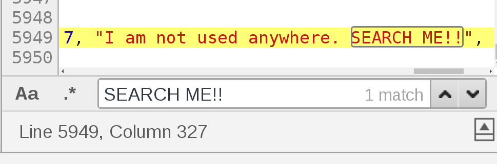
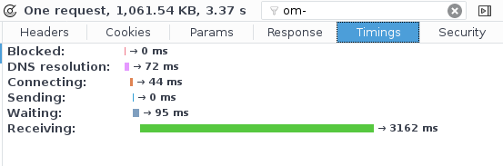
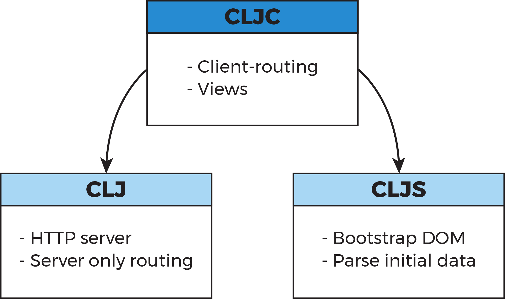

# Server-Side Rendering

Note:
prepare:
- trello board
- picsou page full-screen with JS
- water

-----

### Some context: Single page application (SPA)

Offers more interactivity than static pages

Dynamically fetch and display content

Manipulates its own **routes/URLs**

Note:
The back button works in good SPAs!

-----

### The tradeoffs

First rendering is slow:  
download JS -> interpret JS (-> fetch data) -> render

SEO is really tricky for dynamic content

-----

### Even worst for Clojurescript

Generated JS payloads get big real fast

<svg style="vertical-align: middle" height="60" version="1.1" viewBox="0 0 12 16" width="45"><path fill-rule="evenodd" d="M4 9H3V8h1v1zm0-3H3v1h1V6zm0-2H3v1h1V4zm0-2H3v1h1V2zm8-1v12c0 .55-.45 1-1 1H6v2l-1.5-1.5L3 16v-2H1c-.55 0-1-.45-1-1V1c0-.55.45-1 1-1h10c.55 0 1 .45 1 1zm-1 10H1v2h2v-1h3v1h5v-2zm0-10H2v9h9V1z"></path></svg>
[chpill/cljs-weight](https://github.com/chpill/cljs-weight)


-----

|                          | JS   | GZIP |
|--------------------------|------|------|
| (js/alert "hello world") | 5K   | 2K   |
| 1 core.async channel     | 105K | 24K  |
| 1 clojure.spec spec      | 116K | 26K  |
| client routing           | 157K | 37K  |
| 1 Rum view               | 270K | 72K  |
| core async + websockets  | 480K | 116K |
|--------------------------|------|------|
| all together             | 680K | 175K |

-----

### A parenthesis about "Dead Code Elimination"

Did you know that a map literal with more than 8 keys cannot be DCE?

```
(def unused-big-literal-map
  {:1 "I am not used anywhere. SEARCH ME!!"
   :2 2
   :3 3
   :4 4
   :5 5
   :6 6
   :7 7
   :8 8
   :9 9})
```

-----

## ouch...



Note:
Cannot even open that on emacs

-----

### More details about the pitfalls of DCE

<svg style="vertical-align: middle" height="60" version="1.1" viewBox="0 0 12 16" width="45"><path fill-rule="evenodd" d="M4 9H3V8h1v1zm0-3H3v1h1V6zm0-2H3v1h1V4zm0-2H3v1h1V2zm8-1v12c0 .55-.45 1-1 1H6v2l-1.5-1.5L3 16v-2H1c-.55 0-1-.45-1-1V1c0-.55.45-1 1-1h10c.55 0 1 .45 1 1zm-1 10H1v2h2v-1h3v1h5v-2zm0-10H2v9h9V1z"></path></svg>
[binaryage/cljs-devtools issue #37](https://github.com/binaryage/cljs-devtools/issues/37)

Note:
Some talk about issues in the compiler use of caches
Mentions protocols, cljs.pprint etc...

-----

### Extreme case: web front-end of CircleCI

26317 lines of cljs  
277 lines of clj (macros)

 **3.4M** of JS (**1.02M** when gzipped)



-----

## Server-side rendering

-----

### Pioneered by react

The react router mega demo!

<svg style="vertical-align: middle" height="60" version="1.1" viewBox="0 0 12 16" width="45"><path fill-rule="evenodd" d="M4 9H3V8h1v1zm0-3H3v1h1V6zm0-2H3v1h1V4zm0-2H3v1h1V2zm8-1v12c0 .55-.45 1-1 1H6v2l-1.5-1.5L3 16v-2H1c-.55 0-1-.45-1-1V1c0-.55.45-1 1-1h10c.55 0 1 .45 1 1zm-1 10H1v2h2v-1h3v1h5v-2zm0-10H2v9h9V1z"></path></svg>
[ryanflorence/react-router-mega-demo](https://github.com/ryanflorence/react-router-mega-demo/)

<svg height=60 viewBox="0 25 310 260" style="enable-background:new 0 0 310 310; vertical-align:middle;" xml:space="preserve"> <path d="M297.917,64.645c-11.19-13.302-31.85-18.728-71.306-18.728H83.386c-40.359,0-61.369,5.776-72.517,19.938   C0,79.663,0,100.008,0,128.166v53.669c0,54.551,12.896,82.248,83.386,82.248h143.226c34.216,0,53.176-4.788,65.442-16.527   C304.633,235.518,310,215.863,310,181.835v-53.669C310,98.471,309.159,78.006,297.917,64.645z M199.021,162.41l-65.038,33.991   c-1.454,0.76-3.044,1.137-4.632,1.137c-1.798,0-3.592-0.484-5.181-1.446c-2.992-1.813-4.819-5.056-4.819-8.554v-67.764   c0-3.492,1.822-6.732,4.808-8.546c2.987-1.814,6.702-1.938,9.801-0.328l65.038,33.772c3.309,1.718,5.387,5.134,5.392,8.861   C204.394,157.263,202.325,160.684,199.021,162.41z" style="fill: rgb(0, 0, 0);"></path> </svg>
[the talk](https://www.youtube.com/watch?v=XZfvW1a8Xac)

Can we do that without nodeJS?

Note:
- First react conf, 30 january 2015

-----

# DEMO TIME

Note:
- Make a demo of reverboard!
- Show the back button!
- born at the crossroad of need with the passion for over-engineering

-----

### We can do that on the JVM!


<svg style="vertical-align: middle" height="60" version="1.1" viewBox="0 0 12 16" width="45"><path fill-rule="evenodd" d="M4 9H3V8h1v1zm0-3H3v1h1V6zm0-2H3v1h1V4zm0-2H3v1h1V2zm8-1v12c0 .55-.45 1-1 1H6v2l-1.5-1.5L3 16v-2H1c-.55 0-1-.45-1-1V1c0-.55.45-1 1-1h10c.55 0 1 .45 1 
1zm-1 10H1v2h2v-1h3v1h5v-2zm0-10H2v9h9V1z"></path></svg>
[arohner/foam](https://github.com/arohner/foam)

No need for nodeJS, write your UI in **cljc**!

Note:
Previous attempts would do like other languages and launche nodeJS processes

-----

### Reader conditionals #?

```
#?(:cljs (js/alert "PLOP")
   :clj  (println "PLOP"))
```
```
;; what the cljs compiler sees:
(js/alert "PLOP")
```

The splicing flavor:
```
(list #?@(:clj  [5 6 7 8]
            :cljs [1 2 3 4]))
```
```
;; what the cljs compiler sees:
(list 5 6 7 8)
```

-----

### In clojure today

<svg style="vertical-align: middle" height="60" version="1.1" viewBox="0 0 12 16" width="45"><path fill-rule="evenodd" d="M4 9H3V8h1v1zm0-3H3v1h1V6zm0-2H3v1h1V4zm0-2H3v1h1V2zm8-1v12c0 .55-.45 1-1 1H6v2l-1.5-1.5L3 16v-2H1c-.55 0-1-.45-1-1V1c0-.55.45-1 1-1h10c.55 0 1 .45 1 
1zm-1 10H1v2h2v-1h3v1h5v-2zm0-10H2v9h9V1z"></path></svg>
[tonsky/rum](https://github.com/tonksy/rum)

<svg style="vertical-align: middle" height="60" version="1.1" viewBox="0 0 12 16" width="45"><path fill-rule="evenodd" d="M4 9H3V8h1v1zm0-3H3v1h1V6zm0-2H3v1h1V4zm0-2H3v1h1V2zm8-1v12c0 .55-.45 1-1 1H6v2l-1.5-1.5L3 16v-2H1c-.55 0-1-.45-1-1V1c0-.55.45-1 1-1h10c.55 0 1 .45 1 
1zm-1 10H1v2h2v-1h3v1h5v-2zm0-10H2v9h9V1z"></path></svg>
[omcljs/om-next](https://github.com/omcljs/om)


Note:
blog post: [rendering reagent on the server using hiccup](https://yogthos.net/posts/2015-11-24-Serverside-Reagent.html)
(if you are using re-frame, tough luck...)

re-frame uses a singleton `db` atom. Maybe something can be tried with dynamic
bindings but it would be seriously nasty.

-----

### views for the server and the client

```
;; my-app.views.example.cljc
(ns my-app.views.example
 (:require [rum.core :as rum]))

(rum/defc header [name user-on-twitter]
  [:header
   [:p (str "Hello, I am " name)]
   [:p [:a {:href user-on-twitter} "Follow me on twitter!"]]])
```


-----

### Code organization




Note:
So we now how to deal with the view part. What about the rest

-----

### Routing in cljc

A lot of choice... The one I used:

<svg style="vertical-align: middle" height="60" version="1.1" viewBox="0 0 12 16" width="45"><path fill-rule="evenodd" d="M4 9H3V8h1v1zm0-3H3v1h1V6zm0-2H3v1h1V4zm0-2H3v1h1V2zm8-1v12c0 .55-.45 1-1 1H6v2l-1.5-1.5L3 16v-2H1c-.55 0-1-.45-1-1V1c0-.55.45-1 1-1h10c.55 0 1 .45 1 1zm-1 10H1v2h2v-1h3v1h5v-2zm0-10H2v9h9V1z"></path></svg>
[juxt/bidi](https://github.com/juxt/bidi)

Note:
[DomKM/silk](https://github.com/DomKM/silk)


-----

### Hard problem to tackle: data fetching

Om next has a big advantage here, as it makes the views declare their data needs.

You will need to find a way to map routes with data needs.

Note:
GraphQL server now has a clojure implementation!
On the client side, wrapping apollo or relay might do the trick.

-----

### An abridged index.html

```
<html>
  <head>...</head>
  <body>
    <div id="my-app-container">
      {{{HTML of the app}}}
    </div>

    <script id="my-app-data" type="application/json">
      {{{data used to render HTML above, as json}}}
    </script>

    <script type="text/javascript" src="/js/my-app.js"></script>
  </body>
</html>

```


-----

### Pitfall #1

Be mindful of how you inject the data in the html page

```
<!-- If you do that, it will work at first... -->
<script type="text/javascript" >
  window.bootstrapData = {{{data used to render HTML above}}};
</script>

```

-----

## So you thought JSON was a subset of JS...


-----

### Not the same character set!

For example `\u2028` (line separator) and `\u2029` (paragraph separator) are
legal in json, but illegal in a js file or script tag...

-> Put the json data in a script tag with a type "application/json"
```
<script type="application/json">
  {{{your app data as hson}}}
</script>
```

Note:

-----

### Pitfall #2

Make sure you use the same character encoding in the html and on your server!

```
<head>
  <meta charset="utf-8">
  ...
</head>
```

```
(-> {:body (server-side-render some-data)}
    (response/content-type "text/html")
    (response/charset "UTF-8")
```

-----

### React will tell you when it cannot reuse markup


-----

### How to wrap a react lib to get it working on the server

```
(ns my-app.views.flip-move
  (:require [rum.core :as rum]
             ;; This must match your extern declaration
            #?(:cljs com.react-flip-move.FlipMove))) 

(rum/defc wrapper [children]
  #?(:clj [:div 
           {:style {:position "relative"}}
           children]
     :cljs (js/React.createElement js/FlipMove
                                   children)))

```

-----

## Thanks for listening! Questions?

### Contact infos

**Etienne Spillemaeker**

[github.com/chpill](https://github.com/chpill)

[twitter.com/chpill_](https://twitter.com/chpill_)

